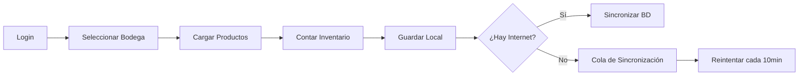

# 📦 SISTEMA DE INVENTARIO FOODIX - DOCUMENTACIÓN COMPLETA

> **Última actualización**: 21 de Julio de 2025  
> **Versión**: 1.0.0  
> **Estado**: Producción

## 📋 TABLA DE CONTENIDOS

1. [Descripción General](#descripción-general)
2. [Arquitectura del Sistema](#arquitectura-del-sistema)
3. [Estructura del Proyecto](#estructura-del-proyecto)
4. [Tecnologías Utilizadas](#tecnologías-utilizadas)
5. [Instalación y Configuración](#instalación-y-configuración)
6. [Base de Datos](#base-de-datos)
7. [API Backend](#api-backend)
8. [Frontend - Componentes](#frontend---componentes)
9. [Servicios y Utilidades](#servicios-y-utilidades)
10. [Sistema de Autenticación y Permisos](#sistema-de-autenticación-y-permisos)
11. [Flujos de Trabajo](#flujos-de-trabajo)
12. [Reglas de Desarrollo](#reglas-de-desarrollo)
13. [Casos de Uso Específicos](#casos-de-uso-específicos)
14. [Troubleshooting](#troubleshooting)
15. [Deployment](#deployment)

---

## 📝 DESCRIPCIÓN GENERAL

Sistema de inventario multi-bodega para ChiosBurger que permite:
- Conteo de inventario en 9 bodegas diferentes
- Sincronización offline/online con PostgreSQL
- Integración con Airtable para catálogo de productos
- Sistema de auditoría completo
- Exportación en múltiples formatos
- Notificaciones en tiempo real
- Interfaz optimizada para móviles

### Características Principales:
- **Offline-First**: Funciona sin conexión, sincroniza cuando hay internet
- **Multi-usuario**: Sistema de roles y permisos granular
- **Auditable**: Registro completo de cambios y eliminaciones
- **Responsive**: Diseñado para tablets y móviles
- **Tiempo Real**: Notificaciones instantáneas entre bodegas

---

## 🏗️ ARQUITECTURA DEL SISTEMA

```
┌─────────────────┐     ┌─────────────────┐     ┌─────────────────┐
│                 │     │                 │     │                 │
│   Frontend      │────▶│   Backend API   │────▶│   PostgreSQL    │
│   (React/TS)    │     │   (Express)     │     │   (Azure)       │
│                 │     │                 │     │                 │
└────────┬────────┘     └─────────────────┘     └─────────────────┘
         │                                                 ▲
         │              ┌─────────────────┐               │
         └─────────────▶│    Airtable     │               │
                        │   (Productos)    │               │
                        └─────────────────┘               │
                                                          │
         ┌────────────────────────────────────────────────┘
         │              Sincronización Automática
         │              (cada 10 minutos)
         ▼
┌─────────────────┐
│   localStorage   │
│  (Offline Cache) │
└─────────────────┘
```

### Componentes Clave:
1. **Frontend React**: SPA con TypeScript y Tailwind CSS
2. **Backend Express**: API RESTful con Node.js
3. **PostgreSQL**: Base de datos principal en Azure
4. **Airtable**: Catálogo maestro de productos
5. **localStorage**: Cache local para modo offline

---

## 📁 ESTRUCTURA DEL PROYECTO

```
inventario_foodix/
├── dist/                      # Build de producción
├── node_modules/              # Dependencias del frontend
├── public/                    # Assets públicos
│   └── vite.svg
├── scripts/                   # Scripts utilitarios
│   └── ejecutar_sql_tiempos.js
├── server/                    # Backend Express
│   ├── node_modules/          # Dependencias del backend
│   ├── create_audit_table.sql # Script de auditoría
│   ├── index.js              # Servidor principal
│   ├── package.json          # Dependencias backend
│   ├── render.yaml           # Config para Render.com
│   ├── start.js              # Entry point producción
│   └── web.config            # Config para IIS
├── sql/                       # Scripts SQL
│   ├── add_categoria_tipo_columns.sql
│   └── crear_tablas_tiempos.sql
├── src/                       # Código fuente frontend
│   ├── assets/               # Imágenes y recursos
│   ├── components/           # Componentes React
│   │   ├── AuditoriaEdiciones.tsx
│   │   ├── EditarProductoModal.tsx
│   │   ├── Historico.tsx
│   │   ├── HistoricoMovilOpciones.tsx
│   │   ├── HistoricoOpciones.tsx
│   │   ├── ListaProductos.tsx
│   │   ├── Login.tsx
│   │   ├── NotificationModal.tsx
│   │   ├── ProductoConteo.tsx
│   │   ├── ProgressBarOptions.tsx
│   │   ├── SelectorBodega.tsx
│   │   ├── SyncStatus.tsx
│   │   ├── TestInputs.tsx
│   │   ├── Timer.tsx
│   │   └── Toast.tsx
│   ├── hooks/                # Custom hooks
│   │   ├── useDebounce.ts
│   │   └── useOnlineStatus.ts
│   ├── services/             # Servicios de datos
│   │   ├── airtable.ts      # Integración Airtable
│   │   ├── auth.ts          # Autenticación
│   │   ├── database.ts      # Conexión BD
│   │   ├── historico.ts     # Gestión históricos
│   │   └── syncService.ts   # Sincronización
│   ├── types/               # TypeScript types
│   │   └── index.ts
│   ├── utils/               # Utilidades
│   │   ├── dateUtils.ts     # Manejo de fechas
│   │   ├── exportUtils.ts   # Exportación datos
│   │   ├── mobileFixUtils.ts # Fixes móviles
│   │   ├── notificationSystem.ts # Notificaciones
│   │   └── performance.ts   # Optimización
│   ├── App.css              # Estilos globales
│   ├── App.tsx              # Componente principal
│   ├── config.ts            # Configuración
│   ├── index.css            # Estilos Tailwind
│   ├── main.tsx             # Entry point
│   └── vite-env.d.ts        # Types de Vite
├── .env                      # Variables de entorno
├── .gitignore               # Archivos ignorados
├── index.html               # HTML principal
├── netlify.toml             # Config Netlify
├── package.json             # Dependencias frontend
├── postcss.config.js        # Config PostCSS
├── README.md                # Documentación básica
├── tailwind.config.js       # Config Tailwind
├── tsconfig.json            # Config TypeScript
├── vercel.json              # Config Vercel
└── vite.config.ts           # Config Vite
```

---

## 💻 TECNOLOGÍAS UTILIZADAS

### Frontend
- **React 19.1.0** - Framework UI
- **TypeScript 5.8.3** - Tipado estático
- **Vite 6.3.5** - Build tool ultrarrápido
- **Tailwind CSS 4.1.10** - Estilos utilitarios
- **Axios 1.10.0** - Cliente HTTP
- **Lucide React** - Iconos SVG optimizados

### Backend
- **Node.js 20.x** - Runtime JavaScript
- **Express 4.19.2** - Framework web
- **PostgreSQL 8.12.0** - Base de datos
- **CORS 2.8.5** - Manejo de CORS
- **Dotenv 16.4.5** - Variables de entorno

### Herramientas de Desarrollo
- **ESLint** - Linting de código
- **Nodemon 3.1.4** - Hot reload en desarrollo
- **Concurrently** - Ejecutar múltiples procesos

---

## 🚀 INSTALACIÓN Y CONFIGURACIÓN

### Requisitos Previos
- Node.js 20.x o superior
- npm o yarn
- PostgreSQL (o acceso a la BD en Azure)
- Cuenta de Airtable con API key

### Instalación Paso a Paso

1. **Clonar el repositorio**
```bash
git clone https://github.com/Chios-Burger/inventario-chiosburger.git
cd inventario_foodix
```

2. **Instalar dependencias**
```bash
# Instalar todo (frontend + backend)
npm run install:all
```

3. **Configurar variables de entorno**

Crear archivo `.env` en la raíz:
```env
# Frontend
VITE_API_URL=http://localhost:3001/api

# Backend (server/.env)
PORT=3001
DB_HOST=chiosburguer.postgres.database.azure.com
DB_USER=tu_usuario
DB_PASSWORD=tu_password
DB_NAME=InventariosLocales
DB_PORT=5432
FRONTEND_URL=http://localhost:5173
NODE_ENV=development
```

4. **Ejecutar en desarrollo**
```bash
# Frontend y backend simultáneamente
npm run dev:all

# O por separado:
npm run dev          # Frontend en puerto 5173
npm run server:dev   # Backend en puerto 3001
```

5. **Build de producción**
```bash
npm run build
npm run server:start
```

---

## 🗄️ BASE DE DATOS

### Configuración PostgreSQL Azure
```javascript
{
  host: 'chiosburguer.postgres.database.azure.com',
  database: 'InventariosLocales',
  ssl: { rejectUnauthorized: false },
  timezone: 'America/Guayaquil'
}
```

### Tablas de Inventario por Bodega

| Bodega ID | Nombre | Tabla PostgreSQL |
|-----------|--------|------------------|
| 1 | Bodega Principal | `toma_bodega` |
| 2 | Bodega Materia Prima | `toma_materiaprima` |
| 3 | Planta Producción | `toma_planta` |
| 4 | Chios Real Audiencia | `tomasFisicas` |
| 5 | Chios Floreana | `tomasFisicas` |
| 6 | Chios Portugal | `tomasFisicas` |
| 7 | Simón Bolón | `toma_simon_bolon` |
| 8 | Santo Cachón | `toma_santo_cachon` |
| 9 | Bodega Pulmón | `toma_bodegapulmon` |

### Estructura de Tablas

#### Tabla estándar (toma_bodega, toma_materiaprima, etc.)
```sql
CREATE TABLE public.toma_bodega (
    id VARCHAR(255) PRIMARY KEY,
    codigo VARCHAR(50),
    producto VARCHAR(255) NOT NULL,
    fecha DATE NOT NULL,
    usuario VARCHAR(255),
    cantidades VARCHAR(100),
    total DECIMAL(10,3),
    unidad VARCHAR(50),
    categoria VARCHAR(100),
    "Tipo A,B o C" VARCHAR(10)
);
```

#### Tabla tomasFisicas (Locales Chios)
```sql
CREATE TABLE public."tomasFisicas" (
    fecha DATE NOT NULL,
    codtomas VARCHAR(255) PRIMARY KEY,
    cod_prod VARCHAR(50),
    productos VARCHAR(255) NOT NULL,
    unidad VARCHAR(50),
    cantidad VARCHAR(100),
    anotaciones TEXT,
    local VARCHAR(50),
    "cantidadSolicitada" VARCHAR(50),
    uni_bod VARCHAR(50),
    categoria VARCHAR(100),
    "Tipo A,B o C" VARCHAR(10)
);
```

### Tablas de Auditoría

#### auditoria_ediciones
```sql
CREATE TABLE public.auditoria_ediciones (
    id SERIAL PRIMARY KEY,
    registro_id VARCHAR(255),
    fecha_registro DATE,
    usuario_email VARCHAR(255),
    usuario_nombre VARCHAR(255),
    producto_codigo VARCHAR(50),
    producto_nombre VARCHAR(255),
    campo_modificado VARCHAR(50),
    valor_anterior DECIMAL(10,3),
    valor_nuevo DECIMAL(10,3),
    diferencia DECIMAL(10,3),
    motivo TEXT,
    bodega_id INTEGER,
    bodega_nombre VARCHAR(100),
    created_at TIMESTAMP DEFAULT CURRENT_TIMESTAMP
);
```

### Formato de IDs

**Formato Nuevo (recomendado)**:
```
YYMMDD-[bodegaId][codigo]+[timestamp]
Ejemplo: 250721-5CP006+1753110010941

Donde:
- 250721: Fecha (21/07/2025)
- 5: ID de bodega (Floreana)
- CP006: Código del producto
- 1753110010941: Timestamp único de sesión
```

**Formato Antiguo (legacy)**:
```
YYMMDD-[codigo]-[random]
Ejemplo: 250721-CP006-1234
```

---

## 🔌 API BACKEND

### Endpoints Principales

#### 1. Health Check
```http
GET /api/health

Response 200:
{
  "status": "ok",
  "database": "connected",
  "timestamp": "2025-07-21T10:30:45.123Z"
}
```

#### 2. Guardar Inventario
```http
POST /api/inventario
Content-Type: application/json

Body:
{
  "bodegaId": 1,
  "fecha": "2025-07-21",
  "usuario": "Juan Pérez",
  "productos": [{
    "id": "250721-1CP006+1753110010941",
    "codigo": "CP006",
    "nombre": "Tocino Baconator",
    "c1": 10,
    "c2": 5,
    "c3": 0,
    "total": 15,
    "cantidadPedir": 6,
    "unidadBodega": "unidad",
    "categoria": "Cárnicos",
    "tipo": "A"
  }]
}

Response 200:
{
  "success": true,
  "message": "Inventario guardado exitosamente"
}
```

#### 3. Obtener Históricos
```http
GET /api/inventarios/:bodegaId

Response 200:
{
  "success": true,
  "data": [
    {
      "id": "250721-1CP006+1753110010941",
      "codigo": "CP006",
      "producto": "Tocino Baconator",
      "fecha": "2025-07-21",
      "usuario": "Juan Pérez",
      "cantidades": "10+5+0",
      "total": "15",
      "unidad": "unidad",
      "categoria": "Cárnicos",
      "tipo": "A"
    }
  ]
}
```

#### 4. Editar Producto
```http
PUT /api/inventario/:registroId/editar
Content-Type: application/json

Body:
{
  "productoId": "250721-1CP006+1753110010941",
  "valorAnteriorTotal": 15,
  "valorNuevoTotal": 20,
  "valorAnteriorCantidad": 6,
  "valorNuevoCantidad": 10,
  "motivo": "Ajuste por inventario físico",
  "usuarioEmail": "analisis@chiosburger.com",
  "usuarioNombre": "Análisis",
  "productoNombre": "Tocino Baconator",
  "productoCodigo": "CP006",
  "bodegaId": 1,
  "bodegaNombre": "Bodega Principal"
}
```

#### 5. Eliminar Inventario
```http
DELETE /api/inventario/:registroId

Body:
{
  "usuarioEmail": "gerencia@chiosburger.com",
  "usuarioNombre": "Gerencia",
  "registroData": {
    "fecha": "2025-07-21",
    "bodega": "Bodega Principal",
    "bodegaId": 1
  },
  "eliminarDeBD": true
}
```

### Manejo de Errores

Todos los endpoints devuelven errores en formato:
```json
{
  "success": false,
  "message": "Descripción del error",
  "error": "Detalle técnico (solo en desarrollo)"
}
```

---

## ⚛️ FRONTEND - COMPONENTES

### Jerarquía de Componentes

```
App.tsx
├── Login.tsx
├── SelectorBodega.tsx
├── ListaProductos.tsx
│   ├── ProductoConteo.tsx
│   ├── Timer.tsx
│   └── ProgressBarOptions.tsx
├── Historico.tsx
│   ├── EditarProductoModal.tsx
│   └── HistoricoOpciones.tsx
├── NotificationModal.tsx
├── SyncStatus.tsx
└── Toast.tsx
```

### Componentes Principales

#### App.tsx - Componente Raíz
- Gestión de estado global
- Navegación entre vistas
- Control de autenticación
- Sistema de notificaciones

#### Login.tsx
- Autenticación con email y PIN
- Validación de credenciales
- Redirección automática

#### SelectorBodega.tsx
- Grid de bodegas disponibles
- Validación de permisos
- Indicadores visuales de acceso

#### ListaProductos.tsx
- Carga de productos desde Airtable
- Búsqueda y filtrado en tiempo real
- Ordenamiento por múltiples criterios
- Agrupación por categorías
- Guardado de inventario

#### ProductoConteo.tsx
- Entrada de 3 conteos independientes
- Calculadora integrada
- Acciones rápidas (Producto en 0, Inactivo)
- Validación en tiempo real

#### Historico.tsx
- Visualización de registros históricos
- Filtrado avanzado multinivel
- Exportación en múltiples formatos
- Edición con auditoría

---

## 🛠️ SERVICIOS Y UTILIDADES

### Servicios Principales

#### airtable.ts
```typescript
// Obtener productos filtrados por bodega
obtenerProductos(bodegaId: number): Promise<Producto[]>

// Limpiar caché
limpiarCache(): void
```

#### auth.ts
```typescript
// Login con PIN
login(email: string, pin: string): Usuario | null

// Verificar permisos
tienePermisoBodega(bodegaId: number): boolean

// Verificar si es admin
esAdmin(): boolean
```

#### historico.ts
```typescript
// Guardar inventario completo
guardarInventario(
  bodegaId: number,
  bodegaNombre: string,
  productos: Producto[],
  conteos: {[key: string]: Conteo},
  productosGuardados: Set<string>,
  duracion: string
): Promise<void>

// Sincronizar registros locales
sincronizarRegistrosLocales(): Promise<{success: boolean, count: number}>
```

### Utilidades

#### dateUtils.ts
- `obtenerFechaActual()`: Fecha actual en timezone Ecuador
- `fechaAISO()`: Convierte a formato YYYY-MM-DD
- `fechaADisplay()`: Convierte a formato DD/MM/YYYY

#### exportUtils.ts
- `exportarPDF()`: Genera PDF con agrupación
- `exportarCSV()`: CSV con formato específico
- `exportarExcel()`: Excel para administradores

#### notificationSystem.ts
- Sistema de notificaciones en tiempo real
- Solo para bodega principal
- Sonido cada 60 segundos

---

## 🔐 SISTEMA DE AUTENTICACIÓN Y PERMISOS

### Usuarios del Sistema

#### Administradores
| Email | PIN | Permisos |
|-------|-----|----------|
| gerencia@chiosburger.com | 9999 | Acceso total, edición sin restricciones |
| analisis@chiosburger.com | 8888 | Super admin, exportación completa |
| contabilidad@chiosburger.com | 1122 | Solo lectura, exportación |

#### Usuarios por Bodega
| Email | PIN | Bodegas Permitidas |
|-------|-----|-------------------|
| bodegaprincipal@chiosburger.com | 1111 | 1 (Principal), 9 (Pulmón) |
| analista_calidad@chiosburger.com | 2222 | 2 (Materia Prima) |
| produccion@chiosburger.com | 3333 | 3 (Planta) |
| realaudiencia@chiosburger.com | 4444 | 4 (Real Audiencia) |
| floreana@chiosburger.com | 5555 | 5 (Floreana) |
| portugal@chiosburger.com | 6666 | 6 (Portugal) |
| simonbolon@chiosburger.com | 7777 | 7 (Simón Bolón) |
| entrenador@chiosburger.com | 0000 | 8 (Santo Cachón) |

### Reglas de Permisos

#### Edición
- **Usuarios normales**: Solo hasta mediodía del día actual
- **Administradores**: Sin restricción horaria
- **Simón Bolón**: Permisos extendidos los domingos

#### Eliminación
- **Usuarios normales**: Solo registros del día hasta mediodía
- **Administradores**: Cualquier registro
- **Super admin (análisis)**: Eliminación permanente de BD

#### Exportación
- **PDF**: Todos los usuarios
- **CSV**: Solo análisis@chiosburger.com
- **Excel**: Solo administradores

---

## 🔄 FLUJOS DE TRABAJO

### Flujo Principal de Inventario



### Flujo de Edición

1. Usuario abre histórico
2. Filtra registros
3. Selecciona producto para editar
4. Modal de edición con valores actuales
5. Ingresa nuevos valores y motivo
6. Sistema calcula diferencias
7. Guarda en BD y registra auditoría

### Flujo de Notificaciones

1. Local (Chios, Simón, Santo) guarda inventario
2. Sistema detecta guardado
3. Notifica a bodegaprincipal@chiosburger.com
4. Reproduce sonido inicial
5. Repite sonido cada 60 segundos
6. Usuario revisa y limpia notificaciones

---

## 📋 REGLAS DE DESARROLLO

### Reglas Fundamentales

1. **"Usa la solución más simple y directa posible"**
   - Evitar sobre-ingeniería
   - Código claro sobre código "inteligente"

2. **"NO TOQUES LO QUE YA FUNCIONA"**
   - Solo cambios específicos solicitados
   - Preservar funcionalidad existente

3. **"Pregunta si tienes dudas"**
   - Verificar comportamiento esperado
   - Confirmar cambios importantes

4. **"Indica si necesitas reiniciar servidor"**
   - Cambios en backend: SÍ
   - Cambios en frontend: NO

### Estándares de Código

- TypeScript con modo estricto
- Componentes funcionales con hooks
- Nombres descriptivos en español
- Sin comentarios innecesarios
- Formato consistente con Prettier

### Git Workflow

```bash
# Formato de commits
fix: Corregir duplicación al editar productos
feat: Agregar exportación a Excel
docs: Actualizar README con nuevas funciones

# Siempre incluir
🤖 Generated with [Claude Code](https://claude.ai/code)
Co-Authored-By: Claude <noreply@anthropic.com>
```

---

## 🎯 CASOS DE USO ESPECÍFICOS

### Bodega Principal (ID: 1)
- Recibe notificaciones de locales
- Acceso a bodega pulmón
- Vista consolidada de inventarios

### Planta Producción (ID: 3)
- Botón "Todo en 0" disponible
- Reordenamiento automático si guarda incompleto
- Sin campo cantidad a pedir

### Locales Chios (ID: 4,5,6)
- Comparten tabla tomasFisicas
- Campo "local" diferencia entre ellos
- Notifican a bodega principal

### Simón Bolón (ID: 7)
- Permisos especiales los domingos
- Puede editar/eliminar todo el día domingo

### Producto Inactivo
- Marcar con -1 en todos los campos
- No cuenta en totales ni estadísticas
- Visual diferenciado en históricos

---

## 🔧 TROUBLESHOOTING

### Problemas Comunes

#### 1. No se guardan los datos
- Verificar espacio en localStorage (límite 4MB)
- Revisar consola para errores
- Confirmar conexión a internet para sincronización

#### 2. No cargan productos de Airtable
- Verificar API key configurada
- Revisar límite de rate (5 req/seg)
- Limpiar caché con `airtableService.limpiarCache()`

#### 3. Errores de permisos
- Confirmar usuario tiene acceso a bodega
- Verificar horario para edición (antes de mediodía)
- Revisar rol de usuario en config.ts

#### 4. Problemas de sincronización
- Verificar conexión a internet
- Revisar cola en localStorage key "historicos"
- Confirmar credenciales de BD correctas

#### 5. Exportación no funciona
- PDF: Verificar popup blocker
- CSV/Excel: Confirmar permisos de usuario
- Revisar consola para errores de generación

### Comandos de Debug

```javascript
// En consola del navegador

// Ver usuario actual
JSON.parse(localStorage.getItem('usuario'))

// Ver registros pendientes de sincronizar
JSON.parse(localStorage.getItem('historicos'))

// Limpiar caché de productos
localStorage.removeItem('productosCache')

// Ver conteos actuales
Object.keys(localStorage).filter(k => k.startsWith('conteos_'))

// Forzar sincronización
historicoService.sincronizarRegistrosLocales()
```

---

## 🚀 DEPLOYMENT

### Frontend - Netlify

1. Build automático desde GitHub
2. Variables de entorno en Netlify UI
3. Deploy con: `npm run deploy:frontend`

Configuración en `netlify.toml`:
```toml
[build]
  command = "npm run build"
  publish = "dist"

[[redirects]]
  from = "/*"
  to = "/index.html"
  status = 200
```

### Backend - Render

1. Deploy automático desde GitHub
2. Variables de entorno en Render Dashboard
3. Health check en `/api/health`

Configuración en `render.yaml`:
```yaml
services:
  - type: web
    name: inventario-api
    env: node
    buildCommand: "cd server && npm install"
    startCommand: "cd server && npm start"
```

### Base de Datos - Azure PostgreSQL

- Host: chiosburguer.postgres.database.azure.com
- SSL obligatorio
- Backup diario automático
- Escalamiento vertical disponible

### Variables de Producción

```env
# Frontend
VITE_API_URL=https://inventario-api.onrender.com/api

# Backend
NODE_ENV=production
DB_HOST=chiosburguer.postgres.database.azure.com
DB_USER=produccion_user
DB_PASSWORD=*****
FRONTEND_URL=https://inventario-chiosburger.netlify.app
```

---

## 📞 SOPORTE Y CONTACTO

- **Reportar bugs**: https://github.com/Chios-Burger/inventario-chiosburger/issues
- **Email técnico**: analisis@chiosburger.com
- **Documentación API**: `/api` (en desarrollo)

---

## 📄 LICENCIA

Sistema propietario de ChiosBurger. Todos los derechos reservados.

---

## 🔄 HISTORIAL DE CAMBIOS

### v1.0.0 (21/07/2025)
- Fix: Duplicación de cantidades al editar productos con mismo nombre
- Fix: Área clickeable completa en selector de bodegas
- Mejora: Lógica condicional para IDs con/sin timestamp
- Documentación: README completo del sistema

### Versiones Anteriores
Ver commits en: https://github.com/Chios-Burger/inventario-chiosburger/commits/main

---

## 🎨 CRÉDITOS

Desarrollado con ❤️ por el equipo de ChiosBurger
- Frontend: React + TypeScript + Tailwind
- Backend: Node.js + Express + PostgreSQL
- Asistencia: Claude (Anthropic)

---

> **Nota**: Este documento contiene información técnica exhaustiva del sistema. Para cambios o mejoras, seguir las reglas de desarrollo establecidas y mantener la documentación actualizada.