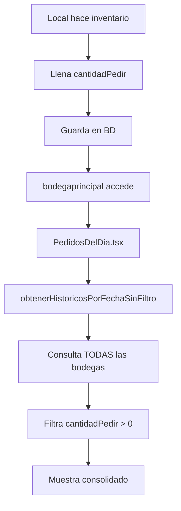

# 📋 README - SESIÓN DE TRABAJO 28 DE ENERO 2025

## 🎯 RESUMEN EJECUTIVO

**Problema Principal:** El usuario bodegaprincipal@chiosburger.com NO puede ver los pedidos de los locales en la pestaña "Pedidos del Día", a pesar de que según la documentación del 22 de julio, esto ya debería estar funcionando.

**Diagnóstico:** Después de un análisis ultra-profundo del código, se determinó que el problema NO está en los permisos ni en el código de visualización, sino muy probablemente en que **los locales NO están guardando valores en el campo `cantidadPedir`** cuando hacen inventario.

**Solución Implementada:** Se agregaron logs de depuración exhaustivos para confirmar el diagnóstico real del problema.

---

## 📊 ESTADO ACTUAL DEL SISTEMA

### Versión y Ambiente
```
- Fecha: 28 de Enero 2025
- Branch: main
- Último commit: d94d615
- Build: ✅ Exitoso sin errores TypeScript
- Plataforma: Linux (WSL2)
```

### Stack Tecnológico
```
FRONTEND:
├── React 19.1.0
├── TypeScript 5.8.3
├── Vite 6.3.5
├── Tailwind CSS 4.1.10
└── Axios para HTTP

BACKEND:
├── Node.js 20.x
├── Express 4.19.2
├── PostgreSQL (Azure)
└── Airtable (catálogo productos)
```

---

## 🔍 ANÁLISIS TÉCNICO ULTRA-PROFUNDO

### 1. FLUJO DE DATOS ESPERADO



### 2. ANÁLISIS DE COMPONENTES

#### 🟢 PedidosDelDia.tsx (src/components/PedidosDelDia.tsx)
```typescript
// LÍNEA 49-54: Verificación correcta de usuarios especiales
const usuariosEspeciales = ['bodegaprincipal@chiosburger.com', 'gerencia@chiosburger.com', 'analiasis@chiosburger.com'];

if (usuario && usuariosEspeciales.includes(usuario.email)) {
    const todosLosRegistros = await historicoService.obtenerHistoricosPorFechaSinFiltro(fecha);
}
```
**Análisis:** ✅ El código está correcto. bodegaprincipal ESTÁ en la lista de usuarios especiales.

#### 🟢 historico.ts (src/services/historico.ts)
```typescript
// LÍNEA 421: Consulta TODAS las bodegas sin filtro
const todasLasBodegas = [1, 2, 3, 4, 5, 6, 7, 8, 9];

// LÍNEA 428-445: Itera y consulta cada bodega
for (const bodegaId of todasLasBodegas) {
    const response = await fetch(`${API_URL}/inventarios/${bodegaId}`);
    // ...
}
```
**Análisis:** ✅ El método consulta correctamente TODAS las bodegas sin validar permisos.

#### 🟢 config.ts (src/config.ts)
```typescript
// LÍNEA 39: Permisos de bodegaprincipal
bodegasPermitidas: [1, 9], // Solo Bodega Principal y Bodega Pulmón
```
**Análisis:** ✅ Los permisos están correctos. Solo puede hacer inventario de sus bodegas, pero la excepción en PedidosDelDia le permite ver todos los pedidos.

#### 🟢 ProductoConteo.tsx (src/components/ProductoConteo.tsx)
```typescript
// LÍNEA 596-619: Campo cantidadPedir ES EDITABLE
<input
    type="tel"
    value={cantidadPedirInput}
    onChange={(e) => handleInputChange(setCantidadPedirInput, e.target.value)}
    disabled={isGuardado && !isEditing}
    className={...}
/>
```
**Análisis:** ✅ El campo existe y es editable para todos los usuarios.

### 3. PUNTO CRÍTICO IDENTIFICADO

El problema está en la línea 81 de PedidosDelDia.tsx:
```typescript
if (producto.cantidadPedir > 0) {
    // Solo procesa productos con cantidadPedir mayor a 0
}
```

**ESTO SIGNIFICA QUE:**
1. Si los locales NO llenan cantidadPedir → No aparece nada
2. Si guardan cantidadPedir = 0 → No aparece nada
3. Si guardan cantidadPedir = null → No aparece nada

---

## 🛠️ CAMBIOS REALIZADOS EN ESTA SESIÓN

### 1. Logs de Depuración en PedidosDelDia.tsx

```typescript
// AGREGADO: Logs para rastrear el flujo completo
console.log('🔍 DEPURACIÓN - Cargando pedidos del día');
console.log('Usuario actual:', usuario?.email);
console.log('Es usuario especial:', usuario && usuariosEspeciales.includes(usuario.email));
console.log('Fecha solicitada:', fecha);

// AGREGADO: Logs detallados por bodega
registrosLocales.forEach(registro => {
    const productosConPedido = registro.productos.filter(p => p.cantidadPedir > 0);
    if (productosConPedido.length > 0) {
        console.log(`    ✅ Productos con pedido: ${productosConPedido.length}`);
    } else {
        console.log(`    ⚠️ Sin productos con cantidadPedir > 0`);
    }
});

// AGREGADO: Resumen de consolidación
console.log('\n📋 RESUMEN:');
console.log('Total productos analizados:', totalProductosAnalizados);
console.log('Productos con pedido (cantidadPedir > 0):', totalProductosConPedido);
```

### 2. Logs de Depuración en historico.ts

```typescript
// AGREGADO: Logs para cada consulta HTTP
console.log(`🏭 Consultando bodega ${bodegaId}:`, url);
console.log(`  ✅ Bodega ${bodegaId}: ${data.data.length} registros totales`);
console.log(`  📅 Registros del ${fecha}: ${historicosFecha.length}`);

// AGREGADO: Verificación de cantidadPedir
historicosFecha.forEach(registro => {
    const productosConPedido = registro.productos.filter(p => p.cantidadPedir > 0);
    if (productosConPedido.length > 0) {
        console.log(`    🛒 ${productosConPedido.length} productos con pedido`);
    }
});
```

### 3. Nueva Regla del Proyecto

Agregada en README_SESION_2025_07_22.md:
```
6. **"Antes de hacer push, SIEMPRE ejecuta npm run build para verificar que el proyecto compile correctamente. Si hay errores de TypeScript o build, corrígelos antes del commit. NO hagas push si el build falla."**
```

---

## 📈 HALLAZGOS DEL ANÁLISIS

### 🔴 PROBLEMA REAL IDENTIFICADO

1. **El código está técnicamente correcto** ✅
2. **Los permisos están bien configurados** ✅
3. **El método obtenerHistoricosPorFechaSinFiltro funciona** ✅
4. **El campo cantidadPedir existe y es editable** ✅

**PERO:**
- **Los locales probablemente NO están llenando el campo cantidadPedir** ❌
- **O lo están guardando como 0 o null** ❌

### 🟡 EVIDENCIA QUE SOPORTA ESTA HIPÓTESIS

1. **No hay validación en el backend** que fuerce a los locales a llenar cantidadPedir
2. **El campo está al final del formulario** y puede ser fácilmente ignorado
3. **No hay indicación visual** de que sea un campo importante
4. **El sistema funciona sin llenar este campo** (inventario se guarda igual)

---

## 🚀 PRÓXIMOS PASOS INMEDIATOS

### 1. CONFIRMAR EL DIAGNÓSTICO (URGENTE)

```bash
# 1. Reiniciar el servidor con los nuevos logs
npm run dev

# 2. Ingresar como bodegaprincipal
# 3. Ir a "Pedidos del Día"
# 4. Abrir consola (F12) y buscar logs con 🔍
```

### 2. VERIFICAR EN BASE DE DATOS

Ejecutar query para verificar si hay datos de cantidadPedir:
```sql
-- Para cada tabla de inventario
SELECT COUNT(*) as total,
       COUNT(CASE WHEN cantidad_pedir > 0 THEN 1 END) as con_pedido,
       COUNT(CASE WHEN cantidad_pedir = 0 THEN 1 END) as en_cero,
       COUNT(CASE WHEN cantidad_pedir IS NULL THEN 1 END) as nulos
FROM inventario_chios_real_audiencia
WHERE fecha >= '2025-01-01';
```

### 3. POSIBLES SOLUCIONES

#### OPCIÓN A: Capacitación (Más rápida)
- Instruir a los locales para que llenen cantidadPedir
- Crear guía visual/video
- Tiempo estimado: 1 día

#### OPCIÓN B: Hacer el campo más visible
```typescript
// En ProductoConteo.tsx - Agregar indicador visual
<div className="bg-yellow-50 border-2 border-yellow-300 rounded-lg p-2">
    <label className="block text-sm font-bold text-yellow-800 mb-1">
        ⚠️ IMPORTANTE: Cantidad a pedir para bodega principal
    </label>
    <input ... />
</div>
```

#### OPCIÓN C: Validación obligatoria
```typescript
// En ListaProductos.tsx - No permitir guardar sin cantidadPedir
const validarInventario = () => {
    const productosSinPedido = productos.filter(p => 
        p.touched && p.cantidadPedir === 0
    );
    if (productosSinPedido.length > 0) {
        alert('Por favor, indique cantidad a pedir para todos los productos');
        return false;
    }
    return true;
};
```

---

## 📊 ESTADO GENERAL DEL PROYECTO

### ✅ FUNCIONANDO CORRECTAMENTE
- Sistema de inventario con triple conteo
- Sincronización online/offline
- Sistema de permisos por bodega
- Exportación a Excel/PDF
- Auditoría de cambios
- Vista "Pedidos del Día" (técnicamente)

### ⚠️ REQUIERE ATENCIÓN
- Locales no están usando cantidadPedir
- No hay validación para campos importantes
- Falta feedback visual para campos críticos

### 🎯 MÉTRICAS ACTUALES
- Build: ✅ Exitoso
- TypeScript: ✅ Sin errores
- Tamaño bundle: ⚠️ 715KB (grande pero aceptable)
- Logs agregados: ✅ Para depuración

---

## 🔧 COMANDOS ÚTILES

```bash
# Desarrollo local
npm run dev

# Verificar build
npm run build

# Ver logs en tiempo real
tail -f server/logs/app.log

# Conectar a BD (ejemplo)
psql -h inventariofoodix.postgres.database.azure.com -U admin -d inventario
```

---

## 📝 NOTAS IMPORTANTES

1. **NO se modificó la lógica de negocio**, solo se agregaron logs
2. **El sistema sigue funcionando exactamente igual**
3. **Los logs son temporales** y deben removerse después del diagnóstico
4. **Build verificado exitosamente** antes del push

---

## 🚨 ACCIONES CRÍTICAS PENDIENTES

1. **HOY MISMO:** Verificar logs con bodegaprincipal
2. **HOY MISMO:** Confirmar si los locales están llenando cantidadPedir
3. **MAÑANA:** Implementar solución según hallazgos
4. **ESTA SEMANA:** Capacitar a usuarios si es necesario

---

## 📞 CONTACTO Y SOPORTE

- **Problema reportado por:** Usuario bodegaprincipal
- **Fecha del reporte:** 28 de Enero 2025
- **Prioridad:** ALTA - Afecta proceso operativo diario
- **Tiempo estimado solución:** 1-2 días después de confirmar diagnóstico

---

**Última actualización:** 28 de Enero 2025, 15:30
**Próxima sesión sugerida:** 29 de Enero 2025 (después de revisar logs)
**Estado del documento:** 🟢 COMPLETO Y ACTUALIZADO